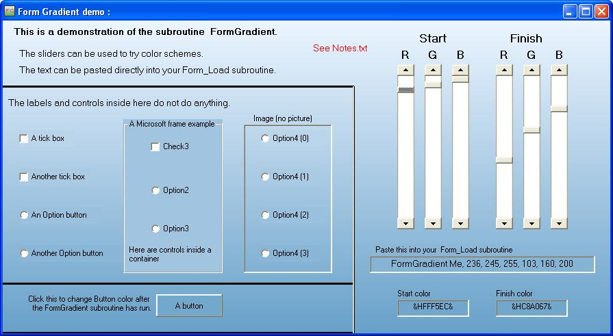



## FormGradient2

### Description

Simple Form color gradient which includes standard controls like OptionButtons, Frames, etc. Single subroutine.

Suitable for beginners.  No APIs, no ActiveX.

Zip contains a small demo project.
 
### More Info
 
See Notes.txt in the zip file for usage.

Simply copy/paste to your own source code.

             |
---                |---
**Submitted On**   |2007-08-17 11:00:32
**By**             |[mike wardle](https://github.com/Planet-Source-Code/PSCIndex/blob/master/ByAuthor/mike-wardle.md)
**Level**          |Advanced
**User Rating**    |4.9 (64 globes from 13 users)
**Compatibility**  |VB 6\.0
**Category**       |[Custom Controls/ Forms/  Menus](https://github.com/Planet-Source-Code/PSCIndex/blob/master/ByCategory/custom-controls-forms-menus__1-4.md)
**World**          |[Visual Basic](https://github.com/Planet-Source-Code/PSCIndex/blob/master/ByWorld/visual-basic.md)
**Archive File**   |[FormGradie2080138202007\.zip](https://github.com/Planet-Source-Code/mike-wardle-formgradient2__1-69186/archive/master.zip)

